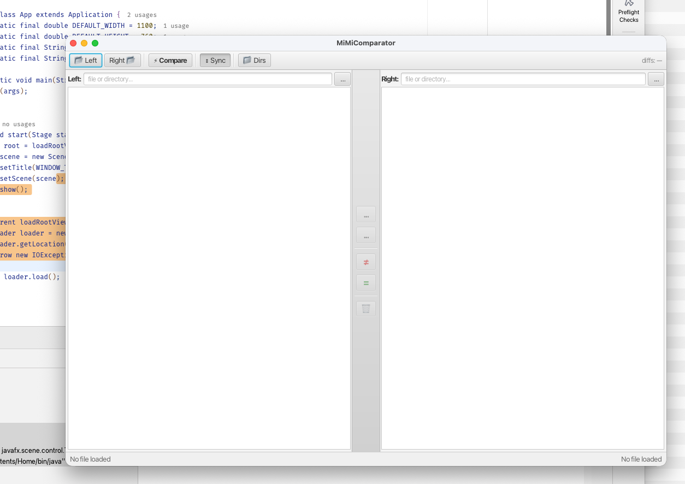

<div align="center">


# MiMiComparator

### Directory and file comparison and synchronization tool for Java 21+ / JavaFX, designed for standalone use and integration into MiMiNavigator.

[](#build-and-run-with-gradle)
[](#about)
[](#build-and-run-with-gradle)
[](#about)
[](#contributing)
[](#license)

[About](#about) •
[Screenshot](#screenshot) •
[Build and Run](#build-and-run-with-gradle) •
[License](#license) •
[Author](#author)

</div>

---

> [!WARNING]
> Under active development. APIs, FXML structure, and UI details may change without notice.

## About

**MiMiComparator** is a desktop application for:

- comparing directories
- comparing files
- synchronizing content between locations
- serving as a reusable comparison/synchronization component for **MiMiNavigator**

The project is written in **Java 21+** and **JavaFX** and is intended to remain open for contribution and redistribution.

## Screenshot

<p align="center">
  
</p>

## Build and Run with Gradle

Use the Gradle wrapper from the project root.

### Run the application

```bash
./gradlew run