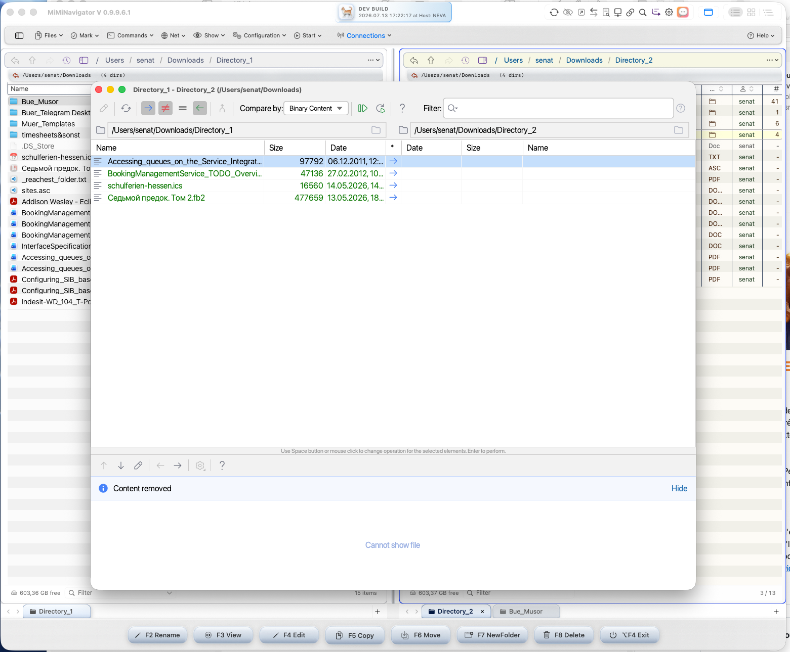

<p align="center">
  
</p>

<div align="center">

# MiMiComparator

### A dual-pane directory and file comparator for macOS

[](#build-and-run)
[](#build-and-run)
[](#about)
[](#build-and-run)
[](#about)
[](#license)
[](#contributing)

[About](#about) •
[Features](#features) •
[Screenshot](#screenshot) •
[Build & Run](#build-and-run) •
[CLI](#cli) •
[Project Structure](#project-structure) •
[Troubleshooting](#troubleshooting) •
[License](#license)

</div>

---

> [!WARNING]
> Under active development. APIs, FXML structure, and UI details may change without notice.

## About

**MiMiComparator** is a Kotlin/JVM desktop application for comparing folders and text files side by side. It uses JavaFX 26, FXML, and
the AtlantaFX Cupertino theme to provide a compact macOS-oriented interface.

Choose two paths, select a comparison mode, and inspect matching, changed, added, or missing entries in synchronized panels. Selecting
a file opens its line-by-line preview in the lower pane.

## Features

- Recursive directory comparison by relative path, size, and modified date
- Binary-content, size, and modification-date comparison modes
- Expandable tree model for directory results with synchronized left/right expansion
- Line-by-line text comparison for file mode
- Side-by-side preview for selected files
- Mirrored metadata columns and a central operation indicator
- Glob-style filter field, for example `**`, `*.kt`, `*.txt`, or comma-separated patterns
- Synchronized vertical scrolling between left and right panels
- Icon-only toolbar with tooltips for compact macOS-style operation
- Persistent window geometry, panel divider positions, mode, sync-scroll state, and input paths
- CLI startup with optional automatic comparison
- Log4j2-based logging with rolling file output

## Screenshot

<p align="center">
  <a href="./Doc/Preview1.png">
    
  </a>
</p>

_Directory comparison with synchronized left and right panels. Click the image to open it at full resolution._

## Tech Stack

| Layer                | Technology                                             |
|----------------------|--------------------------------------------------------|
| Application platform | **Kotlin/JVM desktop app**                             |
| Language             | **Kotlin 2.4.0**                                       |
| UI toolkit           | **JavaFX 26** (FXML + programmatic)                    |
| UI style             | macOS-oriented compact desktop controls                |
| JSON persistence     | Jackson 2.22.1 + jackson-module-kotlin                 |
| Logging              | Log4j2 2.26.1 + SLF4J bridge                           |
| Build                | Gradle 9.6.1 (Kotlin DSL, configuration cache)         |
| JDK                  | 25 bytecode/toolchain; full JDK 26 for macOS packaging |
| Packaging            | `jpackage` → macOS `.app` bundle                       |

## Build and Run

Use the checked-in Gradle wrapper from the project root. Compilation targets JDK 25. The Foojay resolver can provision the compilation
toolchain automatically; macOS packaging additionally requires a full JDK 26 containing `jpackage` and `jmods`.

### Quick start

```zsh
# Run the application
./gradlew run

# Run the tests
./gradlew test

# Build the JAR and distributions
./gradlew build

# Package the macOS application bundle
./gradlew packageMacApp
```

The packaged application is created at:

```text
app/build/jpackage/output/MiMiComparator.app
```

Log4j2 and Jackson component versions are aligned through their respective BOMs in `app/build.gradle.kts`. Kotlin reflection is
explicitly aligned with the Kotlin plugin version.

## IntelliJ IDEA

The project configuration uses:

- Project SDK and bytecode target: JDK 25
- Gradle JVM: full Homebrew JDK 26
- Kotlin language and API version: 2.4
- Build and test execution delegated to Gradle

After opening the project, reload the Gradle project so IntelliJ imports the versions from `app/build.gradle.kts`. Files under `.idea/`
are local IDE settings and are excluded from Git.

## CLI

The application can start empty, restore the saved session, or compare paths immediately.

```zsh
# open normally
./gradlew run

# compare two paths
./gradlew run --args="--left /Users/me/A --right /Users/me/B"

# force directory mode
./gradlew run --args="--left /Users/me/A --right /Users/me/B --dirs"

# force file mode
./gradlew run --args="--left /Users/me/a.txt --right /Users/me/b.txt --files"
```

Positional arguments are also supported:

```zsh
./gradlew run --args="/path/to/left /path/to/right"
```

## Runtime State

User state is stored under:

```text
~/.mimi/comparator/
```

The saved state includes the last left/right paths, directory mode, synchronized scrolling, horizontal and preview divider positions,
and window placement.

The standard Log4j2 configuration writes the active log to:

```text
/tmp/MiMiComparator.log
```

The log rolls at 10 MB and keeps up to four compressed archives named `/tmp/MiMiComparator.N.log.gz`. Console output uses the same
timestamp, level, thread, marker, logger, and message pattern. Method-entry logs use markers such as `APP`, `UI`, `CLI`, `STATE`,
`COMPARE`, and `IO` and include named arguments where useful.

## Project Structure

```
app/src/main/kotlin/org/senatov/
├── App.kt                          # entry point, stage, theme, fonts
├── MainController.kt               # FXML controller and stable event handlers
├── MainControllerChrome.kt         # toolbar, path controls, status and dialogs
├── MainControllerCompare.kt        # file/directory comparison workflow
├── MainControllerHelp.kt           # standard control help/tooltips
├── MainControllerNavigation.kt     # home and compare views
├── MainControllerSplit.kt          # split ratio and synchronized scrolling
├── cli/
│   └── CliArgs.kt                  # CLI argument parser
├── compare/
│   ├── CompareResult.kt            # file compare result (data class)
│   ├── DirCompareResult.kt         # dir compare result (data class)
│   ├── DirectoryComparator.kt      # recursive dir tree compare
│   └── FileContentComparator.kt    # line-by-line text diff
├── helpers/log/
│   └── LogHelper.kt                # common structured method-entry logging
├── model/
│   ├── CompareLineItem.kt          # single row in compare list
│   └── tree/
│       ├── DirTreeModel.kt         # tree state, expand/collapse, flatten
│       └── DirTreeNode.kt          # single node in dir tree
└── ui/
    ├── cell/
    │   └── DiffCellFactory.kt      # ListCell factory (dir/file modes)
    └── config/
        ├── ComparatorState.kt      # persistent UI state (data class)
        └── ComparatorStateService.kt # JSON load/save via Jackson
```

## UI Notes

- Toolbar buttons are icon-only; hover tooltips provide the command names.
- The status bar is reserved for current compare state and counts.
- Directory rows use compact macOS-style spacing with separate disclosure, icon, name, size, and modified-date fields.
- The event log is kept in code for diagnostics but hidden in the main UI.

## Troubleshooting

### Resetting Gradle state

The project enables the Gradle configuration cache and build cache. If build configuration changes produce stale IDE or cache state,
reload the Gradle project in IntelliJ and run:

```zsh
./gradlew clean test
```

### JavaFX native cache errors

If JavaFX cannot write to `~/.openjfx/cache`, clear the cache or run with a temporary cache directory:

```zsh
JAVA_TOOL_OPTIONS="-Djavafx.cachedir=/tmp/openjfxcache" ./gradlew run
```

### Packaging requirements

`packageMacApp` requires a full JDK 26 with `jpackage` and `jmods`. A JRE-only installation is not enough. The task removes an existing
`MiMiComparator.app` from its build output before packaging, so repeated runs are supported.

## Contributing

Contributions welcome — fork, branch, PR. Code style: clean, compact, Kotlin-idiomatic.

## License

[GNU General Public License v3.0](LICENSE)

## Author

**Iakov Senatov** — [github.com/senatov](https://github.com/senatov)
